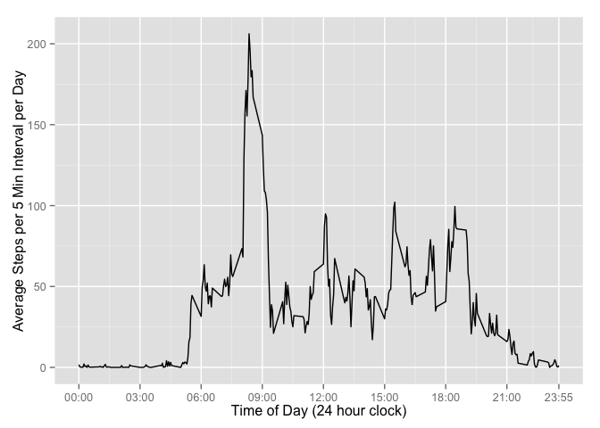

# Reproducible Research: Peer Assessment 1
__Project Overview__

1. [Loading and preprocessing the data][]
1. What is the mean total number of steps taken per day?
1. Show the structure of the data.frame object using str()
1. Perform some basic exploritory analysis
1. Tidy-up the data if ncessary.

## Loading and preprocessing the data
The activity.zip file was included in
[Roger Peng's Peer Assessment1][1] GitHub repository.


1. Unzip activity.zip  
1. Load the data into an R data.frame using read.csv  
1. Use colClasses to create fields with their appropriate data types.  
1. Return the data.frame

```r
loadData <- function() {
    unzip("activity.zip")
    retval <- read.csv("activity.csv", 
                       colClasses=c("integer", "Date", "integer"),
                       stringsAsFactors=FALSE)
    return(retval)
}
activity <- loadData()
```
####<a id="ief"/> Initial Exploritory Findings

```r
summary(activity)
```

```
##      steps             date               interval     
##  Min.   :  0.00   Min.   :2012-10-01   Min.   :   0.0  
##  1st Qu.:  0.00   1st Qu.:2012-10-16   1st Qu.: 588.8  
##  Median :  0.00   Median :2012-10-31   Median :1177.5  
##  Mean   : 37.38   Mean   :2012-10-31   Mean   :1177.5  
##  3rd Qu.: 12.00   3rd Qu.:2012-11-15   3rd Qu.:1766.2  
##  Max.   :806.00   Max.   :2012-11-30   Max.   :2355.0  
##  NA's   :2304
```
* __steps__ shows us we have 2,300 observations with a missing value.
[Imputing missing values][]  
* __date__ shows us we have daily readings from October 1st through 
November 30th, 2012.  
* __interval__ ranges from 0 through 2355 which represents 5 minute intervals.  
taken from midnight (interval=0) through 11:55pm (interval=2355).
<!--

```r
#load the dplyr package, but hide any messages that may result.
library(dplyr)
```

```
## 
## Attaching package: 'dplyr'
## 
## The following object is masked from 'package:stats':
## 
##     filter
## 
## The following objects are masked from 'package:base':
## 
##     intersect, setdiff, setequal, union
```
-->
  
## What is mean total number of steps taken per day?  

####1. Calculate the total number of steps taken per day.  

```r
activity %>% filter(!is.na(steps)) %>% group_by(date) %>%
    summarize(totalSteps=sum(steps)) -> daily_steps
```
####2. Make a histogram of the total number of steps taken each day.
<!--

```r
library(ggplot2)
```

```
## Warning: package 'ggplot2' was built under R version 3.1.3
```
-->

```r
ggplot(data = daily_steps, aes(x = totalSteps)) +
    geom_histogram(binwidth=1000, col="darkblue", fill="lightblue") +
    labs(title="Total Steps Taken per Day",
         x="Steps per Day",
         y="Number of Days")
```

 

####3. Calculate and report the mean and median of the total number of steps taken per day

```r
meanStepsPerDay <- mean(daily_steps$totalSteps, na.rm=TRUE)
meanStepsPerDay
```

```
## [1] 10766.19
```

```r
medianStepsPerDay <- median(daily_steps$totalSteps, na.rm=TRUE)
medianStepsPerDay #median
```

```
## [1] 10765
```

## What is the average daily activity pattern?
#### 1. Make a time series plot of the 5-minute interval (x-axis) and the average number of steps taken, averaged across all days (y-axis)  

Group activity data by __interval__ then calculate average steps per interval

```r
activity %>% filter(!is.na(steps)) %>% 
    group_by(interval) %>%
    summarize(avgSteps = mean(steps)) -> interval
```


```r
# Create a interval formatting function to create pretty time-based labels
intervalFormat <- function(x) {
    sprintf("%02d:%02d", floor(x/100), floor(x %% 100))
}
# Start with 0, increment by 200 until 2200, then add max interval (2355)
xbreaks <- c(seq(0, 2100, by=300), 2355)
# format labels nicely
xlabs <- sapply(xbreaks, intervalFormat)
```
<!--

```r
library(ggplot2)
library(reshape2)
```
-->

```r
ggplot(data=interval, aes(x=interval, y=avgSteps)) +
    geom_line() +
    scale_x_continuous(limits=c(0, 2355),
                       breaks=xbreaks,
                       labels=xlabs
                       ) +
    xlab("Time of Day (24 hour clock)") +
    ylab("Average Steps per 5 Min Interval per Day")
```

 

####2. Which 5-minute interval, on average across all the days in the dataset, contains the maximum number of steps?

```r
interval %>% filter(avgSteps == max(interval$avgSteps))
```

```
## Source: local data frame [1 x 2]
## 
##   interval avgSteps
## 1      835 206.1698
```
## Imputing missing values
####1. Calculate and report the total number of missing values in the dataset

```r
activity %>% filter(is.na(steps)) %>% nrow()
```

```
## [1] 2304
```

####2. Devise a strategy for filling in all of the missing values in the dataset. 
1. Calculate the average daily step value for each interval.
1. Replace any interval with a missing step value with its corresponding imputed
average daily step value.    

####3. Create a new dataset that is equal to the original dataset but with the missing data filled in. 
Calculate the average daily interval step value.

```r
activity %>% filter(!is.na(steps)) -> valid_activity
valid_activity %>% group_by(interval) %>%
    summarize(steps=mean(steps)) %>%
    mutate(steps=floor(steps)) -> imputed_steps
```
Get all intervals with missing step values.

```r
activity %>% filter(is.na(steps)) %>% select(-c(steps)) -> invalid_activity
```
Update each missing interval with its corresponding imputed interval value.

```r
inner_join(invalid_activity, imputed_steps, by=c("interval")) %>%
    select(steps, date, interval) -> fixed_activity
```
Combine valid_activity and fixed_activity into imputed_activity

```r
rbind(valid_activity, fixed_activity) %>% 
    arrange(date, interval) -> imputed_activity
```
####4. Make a histogram of the total number of steps taken each day.


```r
imputed_activity %>% group_by(date) %>% 
    summarize(totalSteps=sum(steps)) -> imputed_daily_steps
```


```r
ggplot(data = imputed_daily_steps, aes(x = totalSteps)) +
    geom_histogram(binwidth=1000, col="darkblue", fill="lightblue") +
    labs(title="Total Steps Taken per Day (imputed values)",
         x="Steps per Day",
         y="Number of Days")

ggplot(data = daily_steps, aes(x = totalSteps)) +
    geom_histogram(binwidth=1000, col="darkblue", fill="lightblue") +
    labs(title="Total Steps Taken per Day (original values)",
         x="Steps per Day",
         y="Number of Days")
```


####Calculate and report the _mean_ and _median_ total number of steps taken per day.

```r
mean <- list( imputed=mean(imputed_daily_steps$totalSteps), 
              original=meanStepsPerDay)
median <-list(imputed=median(imputed_daily_steps$totalSteps),
              original=medianStepsPerDay)
pct <- list(mean=(mean$imputed/mean$original),
            median=(median$imputed/median$origina))
cbind(rbind(mean, median), pct)
```

```
##        imputed  original pct      
## mean   10749.77 10766.19 0.998475 
## median 10641    10765    0.9884812
```
The imputed values differ slightly from the original values. The mean is 99.8%
identical. The median is 98.8% identical.  
The impact of using imputed values is an increase of the number of days which
fall into the average steps per day.


## Are there differences in activity patterns between weekdays and weekends?

```r
activity %>% mutate(dayType=as.factor(ifelse(weekdays(date) %in% c("Saturday", "Sunday"),
                                   "weekend", "weekday"))) -> dow_activity
```
Create average steps per interval per dayType (weekend or weekday)

```r
dow_activity %>% filter(!is.na(steps)) %>%
    group_by(dayType, interval) %>% 
    summarize(avgSteps=mean(steps)) -> dayType_activity
```
Create comparison charts

```r
ggplot(data=dayType_activity, aes(x=interval, y=avgSteps)) +
    geom_line(col = "black") +
    facet_wrap( ~ dayType, ncol=1) +
        scale_x_continuous(limits=c(0, 2355),
                       breaks=xbreaks,
                       labels=xlabs
                       ) +
    xlab("Time of Day (24 hour clock)") +
    ylab("Average Steps per 5 Min Interval per Day") +
    labs(title="Average Daily Steps\nWeekday vs. Weekend")
```

 

It looks like, on average, people get up later and stay active later on the weekends.


[1]: http://github.com/rdpeng/RepData_PeerAssessment1
[2]: #ief
[3]: #tspd
